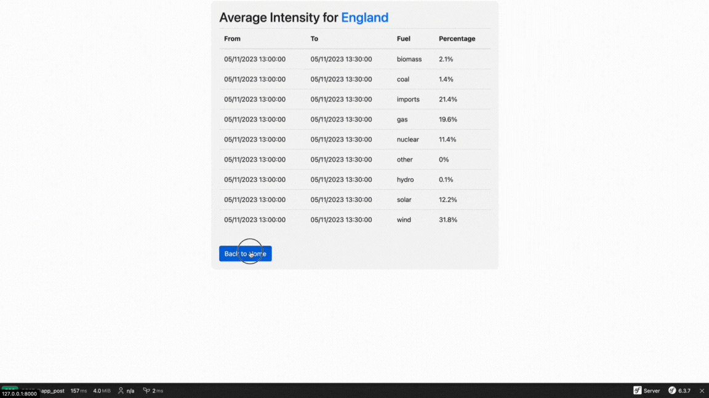

# Carbon Intensity

This project aims to consume a carbon intensity API using the Symfony framework.

For detailed API definitions and usage, please refer to the official documentation [here](https://carbon-intensity.github.io/api-definitions/).



## Installation

1. Create a new Symfony web application:

    ```bash
    symfony new --webapp carbon_intensity
    ```

2. Install the Symfony HTTP client component:

    ```bash
    composer require symfony/http-client
    ```

3. Generate controllers for GET, POST, and the main functionality:

    ```bash
    bin/console make:controller get
    bin/console make:controller post
    bin/console make:controller main
    ```

## Running the Project

Start the Symfony development server:

```bash
symfony server:start
```

## Clear Cache

To clear the cache, use the following command:

```bash
php bin/console cache:clear
```

## Running Tests

To run tests, use PHPUnit:

```bash
vendor/bin/phpunit
```

